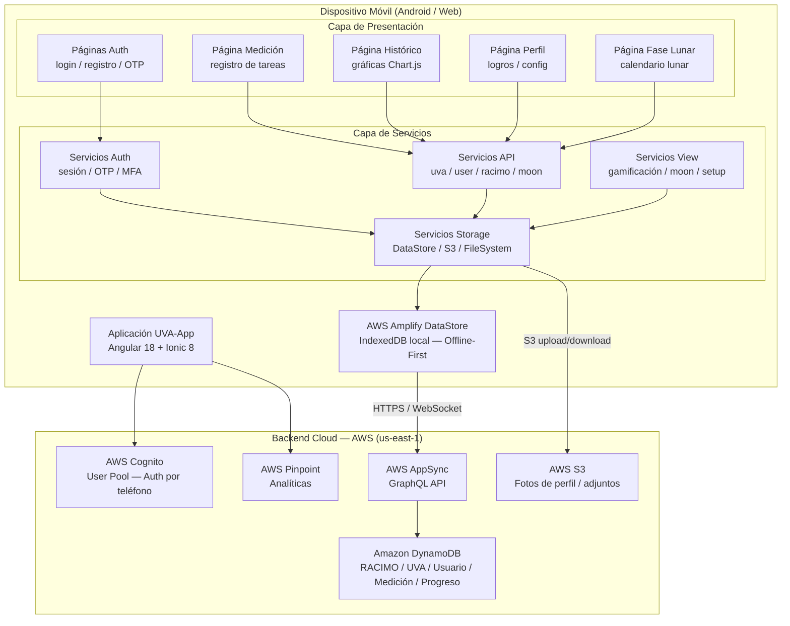

# Arquitectura — UVA-App Frontend

> **Tipo:** Frontend Móvil Híbrido (Angular + Ionic + Capacitor)
> **Framework:** Angular 18 + Ionic 8 + Capacitor 6
> **Backend:** AWS Amplify (AppSync GraphQL + Cognito + DynamoDB)

---

## Descripción General

| Parámetro | Valor |
|-----------|-------|
| Framework | Angular 18 + Ionic 8 |
| Runtime nativo | Capacitor 6 |
| Lenguaje | TypeScript 5.5 |
| Node.js | 20 o superior |
| Gestor de paquetes | npm |
| Puerto de desarrollo | 8100 (ionic serve) |
| Plataforma de despliegue | Android (Google Play) / Web estático |
| App ID | `com.makesens.uvaapp` |
| Versión actual | 2.1.6 (Build 7) |

---

## Diagrama de Arquitectura



---

## Estrategia de Renderizado

La app es una **SPA (Single Page Application)** con renderizado del lado del cliente (CSR). No usa SSR ni SSG.

| Vista | Estrategia | Justificación |
|-------|-----------|---------------|
| Todas las rutas | CSR (Ionic + Angular) | App móvil híbrida — Capacitor ejecuta en WebView |
| Datos locales | DataStore (IndexedDB) | Offline-first: los datos se leen primero desde caché local |
| Datos remotos | Sincronización en segundo plano | AppSync sincroniza cuando hay conexión disponible |

---

## Arquitectura de Capas

### 1. Capa de Presentación (Ionic UI)

- Páginas de Autenticación (auth con OTP por SMS)
- Páginas de Medición (registro de tareas diarias)
- Vistas Históricas (gráficos de series temporales)
- Gestión de Perfil (logros, configuración)
- Calendario de Fases Lunares (integración agrícola)
- UI de Gamificación (semillas, rachas, hitos)

### 2. Capa de Servicios Angular

Organizada por dominio en `src/app/core/services/`:

| Dominio | Servicios |
|---------|-----------|
| `api/` | `uva-api.service.ts`, `user-api.service.ts`, `racimo-api.service.ts`, `moon-phase-api.service.ts` |
| `auth/` | Validación de teléfono, verificación OTP, gestión de tokens, MFA |
| `storage/datastore/` | Servicios envolventes de AWS DataStore |
| `storage/s3/` | Carga y descarga de archivos en S3 |
| `storage/file-system/` | Integración del sistema de archivos de Capacitor |
| `view/gamification/` | Cálculo de progreso y lógica de logros |
| `view/moon/` | Cálculos de fases lunares |
| `view/setup/` | Inicialización y configuración de la app |

### 3. Capa de Datos — AWS Amplify DataStore

- Sincronización offline automática con IndexedDB local
- Actualizaciones optimistas de la UI (la UI responde antes de confirmar con el servidor)
- Resolución de conflictos con versionado (`_version`)
- Suscripciones en tiempo real vía WebSocket (AppSync)

### 4. Capa Backend — Servicios Administrados AWS

| Servicio | Propósito |
|---------|-----------|
| AWS AppSync | API GraphQL administrada con suscripciones en tiempo real |
| AWS Cognito | Autenticación por teléfono + SMS OTP + MFA |
| Amazon DynamoDB | Base de datos NoSQL (accedida vía AppSync) |
| Amazon S3 | Almacenamiento de fotos de perfil y adjuntos |
| AWS Pinpoint | Analíticas de usuario y seguimiento de eventos |

---

## Flujos de Datos Principales

### Flujo Offline-First

```
Acción del Usuario
    → Componente Angular
    → Capa de Servicios (Lógica de Negocio)
    → API de DataStore (Guardar localmente en IndexedDB)
    → Actualización de UI optimista (inmediata)
    → Sincronización en 2do plano (cuando hay conexión)
    → AWS AppSync (GraphQL)
    → DynamoDB
    → Resolución de conflictos (si es necesario)
    → Actualización final de UI
```

### Flujo de Autenticación

```
1. Usuario ingresa número de teléfono
2. Cognito envía SMS OTP
3. Usuario ingresa código OTP (6 dígitos)
4. Cognito valida y emite tokens JWT
5. App almacena sesión (Capacitor SecureStorage)
6. Amplify se configura con credenciales del usuario
7. DataStore sincroniza datos del usuario
8. Redirección a inicio/pestañas
```

### Flujo de Envío de Medición

```
1. Usuario selecciona una tarea
2. Validación (restricciones horarias, campos, duplicados)
3. Guardar en DataStore (local-first)
4. UI actualizada inmediatamente (optimista)
5. Sincronización en 2do plano con AppSync
6. Mutación GraphQL a DynamoDB
7. Actualizar progreso del usuario (gamificación)
8. Sincronizar de vuelta al dispositivo
```

---

## Patrones de Diseño Utilizados

| Patrón | Descripción | Implementación |
|--------|-------------|----------------|
| Offline-First | Datos locales con sincronización en 2do plano | AWS Amplify DataStore + IndexedDB |
| Orientado a Servicios | Separación de responsabilidades por dominio | `src/app/core/services/` |
| Programación Reactiva | Operaciones asíncronas con observables | RxJS 7.8 |
| Componentes Standalone | Angular moderno sin NgModules | Tree-shaking optimizado |
| Patrón Repositorio | Abstracción de fuente de datos en servicios | Servicios DataStore como repositorios |
| UI Optimista | Actualizar UI antes de confirmación del servidor | DataStore actualizaciones optimistas |

---

## Arquitectura de Seguridad

### Autenticación
- Basada en teléfono (sin contraseñas)
- Verificación por SMS OTP
- Cumplimiento de MFA
- Almacenamiento seguro de tokens vía Capacitor SecureStorage

### Autorización
- Acceso a datos con alcance por usuario (owner-based)
- Autorización basada en propietario en GraphQL (`@auth`)
- Almacenamiento privado de archivos en S3

### Protección de Datos
- HTTPS para todas las llamadas a la API
- Almacenamiento local cifrado
- DOMPurify para saneamiento de HTML
- Política de Seguridad de Contenido estricta
- ESLint sin tipos `any`, TypeScript en modo estricto

---

## Arquitectura de Pruebas

| Tipo | Herramienta | Cobertura |
|------|-------------|-----------|
| Pruebas unitarias | Karma + Jasmine | 56+ archivos `.spec.ts` |
| Runner CI | Chrome Headless / Firefox Headless | Automático en cada commit |
| Cobertura | Istanbul | Reportes de cobertura generados |

---

## Proceso de Compilación

```
Código Fuente (TypeScript/SCSS)
    → Compilador Angular (AOT)
    → Empaquetado con Webpack
    → Minificación y Optimización
    → Build Web (www/)
    → Copia a Capacitor (cap copy)
    → Proyecto Nativo (android/)
    → Compilación con Gradle
    → Salida APK/AAB
```

---

## Optimizaciones de Rendimiento

| Optimización | Implementación |
|-------------|----------------|
| Lazy Loading | Rutas cargadas de forma diferida por página |
| Caché de datos | DataStore almacena todos los datos sincronizados |
| Tree-shaking | Componentes standalone de Angular |
| Compilación AOT | Ahead-of-Time compilation en producción |
| Límite de bundle | 7 MB máximo configurado en Angular |
| Imágenes | Carga diferida + soporte WebP vía Capacitor |

---

## Monitoreo y Analíticas

| Servicio | Propósito |
|---------|-----------|
| AWS Pinpoint | Seguimiento de sesiones, vistas de página, eventos personalizados |
| CloudWatch | Logs y métricas de AppSync, DynamoDB, Cognito, S3 |
| Angular performance | Detección de cambios y perfilado |
| DataStore metrics | Métricas de sincronización y tiempo de respuesta |
