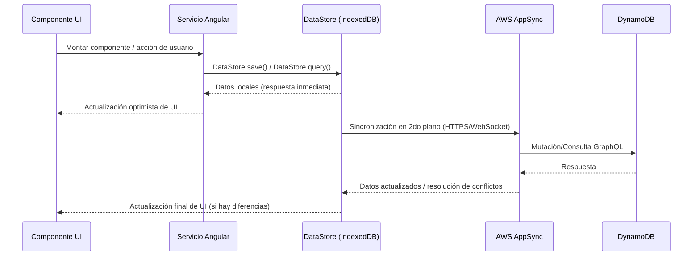

# Modelos de Datos — UVA-App

---

## Descripción General

### Base de Datos
**Amazon DynamoDB** — Base de datos NoSQL accedida a través de la API GraphQL de AWS AppSync y administrada por AWS Amplify DataStore.

### Características Clave
- **Completamente administrada**: Sin mantenimiento de servidor
- **Escalable**: Escalado automático basado en demanda
- **Alta disponibilidad**: Replicación multi-AZ
- **Consistente**: Consistencia eventual con resolución de conflictos
- **Serverless**: Modelo de precios de pago por solicitud

### Archivos de referencia

| Archivo | Descripción |
|---------|-------------|
| `amplify/backend/api/<api-name>/schema.graphql` | Esquema GraphQL autoritativo |
| `src/models/` | Modelos TypeScript autogenerados por Amplify |
| `src/API.ts` | Tipos TypeScript de la API autogenerados |

---

## Diagrama de Entidad-Relación

```
┌─────────────┐
│   RACIMO    │
│ (Proyecto)  │
└──────┬──────┘
       │ 1
       │ N
       ▼
┌─────────────┐         ┌──────────────┐
│     UVA     │ 1 ────► │   Usuario    │
│(Unid./Finca)│         │              │
└──────┬──────┘         └──────┬───────┘
       │ 1                     │ 1
       │ N                     │ N
       ▼                       ▼
┌─────────────┐         ┌──────────────┐
│  Medición   │         │ProgresoUsuar.│
│             │         │              │
└─────────────┘         └──────────────┘
```

---

## Modelos de Datos

### 1. RACIMO

**Descripción:** Almacena información de proyectos/clústeres para la organización multi-inquilino de viñedos

**Tabla DynamoDB:** `RACIMO-<env>-<api-id>`

#### Esquema

| Campo | Tipo | Requerido | Descripción |
|-------|------|-----------|-------------|
| `id` | String (ID) | Si | Identificador único (UUID) |
| `Name` | String | Si | Nombre del proyecto |
| `LinkageCode` | String | Si | Código único de 8 caracteres para unirse |
| `Configuration` | String (JSON) | No | Configuración JSON (zona horaria, campos, etc.) |
| `createdAt` | AWSDateTime | Si | Timestamp de creación del registro |
| `updatedAt` | AWSDateTime | Si | Timestamp de la última actualización |
| `_version` | Int | Si | Versión para bloqueo optimista |
| `_deleted` | Boolean | No | Indicador de eliminación suave |
| `_lastChangedAt` | AWSTimestamp | Si | Timestamp de la última sincronización |

#### Índices

| Tipo | Campo(s) | Propósito |
|------|----------|-----------|
| Clave primaria | `id` | Búsqueda única de proyecto |
| GSI `LinkageCodeIndex` | `LinkageCode` | Búsqueda rápida por código de vinculación |

#### TypeScript Interface

```typescript
export interface RACIMO {
  id: string;
  Name: string;
  LinkageCode: string;
  Configuration?: string;      // JSON serializado
  createdAt: string;           // AWSDateTime
  updatedAt: string;           // AWSDateTime
  _version: number;
  _deleted?: boolean;
  _lastChangedAt: number;      // AWSTimestamp (Unix ms)
}
```

#### Registro de ejemplo

```json
{
  "id": "racimo-550e8400-e29b",
  "Name": "Viñedo Central",
  "LinkageCode": "VINE2025",
  "Configuration": "{\"timezone\":\"America/Santiago\",\"taskSchedule\":\"weekly\"}",
  "createdAt": "2025-01-15T10:30:00.000Z",
  "updatedAt": "2025-01-15T10:30:00.000Z",
  "_version": 1,
  "_deleted": false,
  "_lastChangedAt": 1705318200000
}
```

---

### 2. UVA

**Descripción:** Almacena unidades agrícolas (secciones de viñedo) con datos de ubicación y configuración de campos

**Tabla DynamoDB:** `UVA-<env>-<api-id>`

#### Esquema

| Campo | Tipo | Requerido | Descripción |
|-------|------|-----------|-------------|
| `id` | String (ID) | Si | Identificador único (UUID) |
| `latitude` | String | No | Latitud geográfica |
| `longitude` | String | No | Longitud geográfica |
| `altitude` | String | No | Altitud en metros |
| `fields` | String (JSON) | No | Configuración de campos como JSON |
| `enabled` | Boolean | No | Estado activo (predeterminado: true) |
| `userID` | String (ID) | Si | Clave foránea al Usuario |
| `racimoID` | String (ID) | Si | Clave foránea al RACIMO |
| `createdAt` | AWSDateTime | No | Timestamp de creación del registro |
| `updatedAt` | AWSDateTime | Si | Timestamp de la última actualización |
| `_version` | Int | Si | Versión para bloqueo optimista |
| `_deleted` | Boolean | No | Indicador de eliminación suave |
| `_lastChangedAt` | AWSTimestamp | Si | Timestamp de la última sincronización |

#### Índices

| Tipo | Campo(s) | Propósito |
|------|----------|-----------|
| Clave primaria | `id` | Búsqueda única de UVA |
| GSI `byUser` | `userID` | Encontrar UVA del usuario |
| GSI `byRACIMO` | `racimoID` | Listar todas las UVAs de un proyecto |

#### Relaciones

| Relación | Tipo | Descripción |
|---------|------|-------------|
| Usuario | 1:1 | Cada UVA pertenece a exactamente un Usuario |
| RACIMO | N:1 | Muchas UVAs pertenecen a un RACIMO |

#### TypeScript Interface

```typescript
export interface UVA {
  id: string;
  latitude?: string;
  longitude?: string;
  altitude?: string;
  fields?: string;         // JSON serializado — { fieldA: string, fieldB: string, ... }
  enabled?: boolean;
  userID: string;
  racimoID: string;
  createdAt?: string;
  updatedAt: string;
  _version: number;
  _deleted?: boolean;
  _lastChangedAt: number;
}
```

---

### 3. Usuario

**Descripción:** Almacena el perfil y la información de autenticación del usuario

**Tabla DynamoDB:** `User-<env>-<api-id>`

#### Esquema

| Campo | Tipo | Requerido | Descripción |
|-------|------|-----------|-------------|
| `id` | String (ID) | Si | Identificador único (sub de Cognito) |
| `Name` | String | Si | Nombre de pila |
| `LastName` | String | Si | Apellido |
| `PhoneNumber` | String | Si | Teléfono (nombre de usuario de autenticación) |
| `Email` | String | No | Dirección de email (opcional) |
| `Rank` | String | No | Rango de gamificación (Bronce/Plata/Oro/Platino) |
| `uvaID` | String (ID) | No | Clave foránea a UVA |
| `createdAt` | AWSDateTime | Si | Timestamp de creación de la cuenta |
| `updatedAt` | AWSDateTime | Si | Timestamp de la última actualización |
| `_version` | Int | Si | Versión para bloqueo optimista |
| `_deleted` | Boolean | No | Indicador de eliminación suave |
| `_lastChangedAt` | AWSTimestamp | Si | Timestamp de la última sincronización |

#### Índices

| Tipo | Campo(s) | Propósito |
|------|----------|-----------|
| Clave primaria | `id` | Búsqueda única de usuario |
| GSI `byPhoneNumber` | `PhoneNumber` | Búsqueda en inicio de sesión |
| GSI `byUVA` | `uvaID` | Encontrar propietario de UVA |

#### TypeScript Interface

```typescript
export interface User {
  id: string;
  Name: string;
  LastName: string;
  PhoneNumber: string;
  Email?: string;
  Rank?: 'Bronze' | 'Silver' | 'Gold' | 'Platinum';
  uvaID?: string;
  createdAt: string;
  updatedAt: string;
  _version: number;
  _deleted?: boolean;
  _lastChangedAt: number;
}
```

---

### 4. Measurement (Medición)

**Descripción:** Almacena datos de medición en series temporales recopilados por los usuarios en sus viñedos

**Tabla DynamoDB:** `Measurement-<env>-<api-id>`

#### Esquema

| Campo | Tipo | Requerido | Descripción |
|-------|------|-----------|-------------|
| `id` | String (ID) | Si | Identificador único (UUID) |
| `type` | String | Si | Tipo de medición (ej., "temperature", "humidity") |
| `data` | String (JSON) | No | Datos de medición como JSON |
| `logs` | String (JSON) | No | Metadatos/registros como JSON |
| `ts` | AWSDateTime | Si | Timestamp de la medición |
| `task` | String | No | Identificador de tarea asociada |
| `uvaID` | String (ID) | Si | Clave foránea a UVA |
| `owner` | String | No | Nombre de usuario de Cognito (para auth) |
| `createdAt` | AWSDateTime | Si | Timestamp de creación del registro |
| `updatedAt` | AWSDateTime | Si | Timestamp de la última actualización |
| `_version` | Int | Si | Versión para bloqueo optimista |
| `_deleted` | Boolean | No | Indicador de eliminación suave |
| `_lastChangedAt` | AWSTimestamp | Si | Timestamp de la última sincronización |

#### Índices

| Tipo | Campo(s) | Propósito |
|------|----------|-----------|
| Clave primaria | `id` | Búsqueda única de medición |
| GSI `byUVAandTs` | `uvaID` (PK) + `ts` (SK) | Consultar mediciones por UVA y rango de fechas |

#### Relaciones

| Relación | Tipo | Descripción |
|---------|------|-------------|
| UVA | N:1 | Muchas mediciones pertenecen a una UVA |

#### TypeScript Interface

```typescript
export interface Measurement {
  id: string;
  type: string;
  data?: string;           // JSON serializado — { value: number, unit: string, ... }
  logs?: string;           // JSON serializado — { device: string, battery: number, ... }
  ts: string;              // AWSDateTime — timestamp de la medición
  task?: string;
  uvaID: string;
  owner?: string;
  createdAt: string;
  updatedAt: string;
  _version: number;
  _deleted?: boolean;
  _lastChangedAt: number;
}
```

#### Registro de ejemplo

```json
{
  "id": "measurement-abc123xyz",
  "type": "temperature",
  "data": "{\"value\":23.5,\"unit\":\"celsius\",\"location\":\"fieldA\"}",
  "logs": "{\"device\":\"sensor-01\",\"battery\":85,\"signal\":\"strong\"}",
  "ts": "2025-01-15T14:30:00.000Z",
  "task": "daily-temp-check",
  "uvaID": "uva-123abc456def",
  "owner": "user-789xyz",
  "createdAt": "2025-01-15T14:30:05.000Z",
  "updatedAt": "2025-01-15T14:30:05.000Z",
  "_version": 1,
  "_deleted": false,
  "_lastChangedAt": 1705330205000
}
```

---

### 5. UserProgress (Progreso de Usuario)

**Descripción:** Registra el progreso de gamificación diario (semillas, rachas, hitos) de cada usuario

**Tabla DynamoDB:** `UserProgress-<env>-<api-id>`

#### Esquema

| Campo | Tipo | Requerido | Descripción |
|-------|------|-----------|-------------|
| `id` | String (ID) | Si | Identificador único (UUID) |
| `ts` | String | Si | Fecha del progreso (AAAA-MM-DD) |
| `Seed` | Int | No | Semillas ganadas en esta fecha |
| `Streak` | Int | No | Contador de racha actual |
| `Milestones` | String (JSON) | No | Hitos alcanzados como JSON |
| `SaveStreak` | Boolean | No | Indicador de uso del salvavidas de racha |
| `completedTasks` | Int | No | Número de tareas completadas |
| `additionalInfo` | String (JSON) | No | Metadatos adicionales como JSON |
| `userID` | String (ID) | Si | Clave foránea al Usuario |
| `createdAt` | AWSDateTime | Si | Timestamp de creación del registro |
| `updatedAt` | AWSDateTime | Si | Timestamp de la última actualización |
| `_version` | Int | Si | Versión para bloqueo optimista |
| `_deleted` | Boolean | No | Indicador de eliminación suave |
| `_lastChangedAt` | AWSTimestamp | Si | Timestamp de la última sincronización |

#### Índices

| Tipo | Campo(s) | Propósito |
|------|----------|-----------|
| Clave primaria | `id` | Búsqueda única de registro de progreso |
| GSI `byUserAndDate` | `userID` (PK) + `ts` (SK) | Consultar historial de progreso por usuario y fecha |

#### Relaciones

| Relación | Tipo | Descripción |
|---------|------|-------------|
| Usuario | N:1 | Muchos registros de progreso pertenecen a un usuario |

#### TypeScript Interface

```typescript
export interface UserProgress {
  id: string;
  ts: string;                  // Fecha AAAA-MM-DD
  Seed?: number;
  Streak?: number;
  Milestones?: string;         // JSON serializado — { bronze: bool, silver: bool, ... }
  SaveStreak?: boolean;
  completedTasks?: number;
  additionalInfo?: string;     // JSON serializado
  userID: string;
  createdAt: string;
  updatedAt: string;
  _version: number;
  _deleted?: boolean;
  _lastChangedAt: number;
}
```

---

## Resumen de Índices

### Índices Primarios

| Tabla | Clave de Partición | Propósito |
|-------|-------------------|-----------|
| RACIMO | `id` | Búsqueda única de proyecto |
| UVA | `id` | Búsqueda única de UVA |
| Usuario | `id` | Búsqueda única de usuario |
| Medición | `id` | Búsqueda única de medición |
| ProgresoUsuario | `id` | Búsqueda única de registro de progreso |

### Índices Secundarios Globales (GSI)

| Tabla | Nombre del Índice | PK | SK | Propósito |
|-------|------------------|----|----|-----------|
| RACIMO | LinkageCodeIndex | `LinkageCode` | — | Encontrar RACIMO por código de vinculación |
| UVA | byUser | `userID` | — | Encontrar UVA del usuario |
| UVA | byRACIMO | `racimoID` | — | Listar todas las UVAs de un proyecto |
| Usuario | byPhoneNumber | `PhoneNumber` | — | Búsqueda de inicio de sesión |
| Usuario | byUVA | `uvaID` | — | Encontrar propietario de UVA |
| Medición | byUVAandTs | `uvaID` | `ts` | Consultar mediciones por rango de fechas |
| ProgresoUsuario | byUserAndDate | `userID` | `ts` | Consultar historial de progreso |

---

## Flujo de Datos



---

## Patrones de Acceso a Datos

### 1. Flujo de inicio de sesión
```
Consulta: GSI byPhoneNumber
Entrada: PhoneNumber
Salida: Registro de usuario
```

### 2. Cargar dashboard del usuario
```
1. Obtener Usuario por id (de la autenticación de Cognito)
2. Obtener UVA por userID (GSI byUser)
3. Obtener RACIMO por racimoID
4. Obtener Mediciones recientes (GSI byUVAandTs, últimos 30 días)
5. Obtener ProgresoUsuario (GSI byUserAndDate, últimos 7 días)
```

### 3. Registrar medición
```
1. Crear registro de Medición con uvaID
2. Consultar el ProgresoUsuario más reciente del día
3. Actualizar o Crear ProgresoUsuario (incrementar semillas, racha)
```

### 4. Unirse a RACIMO por código
```
1. Consultar RACIMO por LinkageCode (GSI LinkageCodeIndex)
2. Validar que el código existe
3. Crear UVA con racimoID
4. Actualizar Usuario con uvaID
```

### 5. Ver datos históricos
```
Consulta: GSI byUVAandTs
Filtro: uvaID + ts (rango de fechas)
Ordenamiento: ts DESC
Límite: 100 (paginado)
```

---

## Consistencia de Datos y Resolución de Conflictos

### Bloqueo Optimista

Todas las tablas usan el campo `_version` para bloqueo optimista:
- Cada actualización incrementa `_version`
- Las mutaciones deben incluir la `_version` actual
- Los conflictos ocurren cuando las versiones no coinciden

### Estrategia de Resolución de Conflictos

AWS Amplify DataStore usa la estrategia de **fusión automática (Auto-Merge)**:
1. Los datos del servidor tienen prioridad en caso de conflictos
2. El cliente recibe notificación del conflicto
3. La app puede implementar lógica de resolución personalizada

### Eliminaciones Suaves

Todas las tablas soportan eliminaciones suaves mediante el indicador `_deleted`:
- Los registros se marcan como `_deleted: true` en lugar de eliminarse físicamente
- Permite sincronización entre dispositivos
- Pueden purgarse después de la ventana de sincronización (30 días)

---

## Seguridad a Nivel de Fila

Implementada mediante resolvers de AppSync (`@auth` en el esquema GraphQL):

| Entidad | Acceso |
|---------|--------|
| Usuario | Solo acceso a su propio registro |
| UVA | Propietario y miembros del RACIMO |
| Medición | Propietario y miembros del RACIMO |
| ProgresoUsuario | Solo propietario |
| RACIMO | Solo miembros del clúster |

```graphql
@auth(rules: [
  { allow: owner, ownerField: "owner" },
  { allow: private, operations: [read] }
])
```

---

## Estimaciones de Almacenamiento

| Tabla | Tamaño promedio por registro | Registros por usuario/año | Total por usuario/año |
|-------|------------------------------|--------------------------|----------------------|
| Usuario | 0.5 KB | 1 | 0.5 KB |
| UVA | 1 KB | 1 | 1 KB |
| RACIMO | 1 KB | 0.1 (compartido) | 0.1 KB |
| Medición | 2 KB | 365 * 5 tareas = 1.825 | 3.65 MB |
| ProgresoUsuario | 1 KB | 365 | 365 KB |
| **Total** | — | — | **~4 MB por usuario/año** |

---

## Migración de Datos

### Actualizaciones de Esquema

```bash
# 1. Actualizar el esquema GraphQL
# Archivo: amplify/backend/api/<api-name>/schema.graphql

# 2. Desplegar cambios a AWS
amplify push

# 3. Regenerar modelos del cliente
amplify codegen models
# Genera/actualiza: src/models/ y src/API.ts
```

> DataStore maneja el versionado de esquemas automáticamente. Las tablas DynamoDB se actualizan sin tiempo de inactividad.

---

## Respaldo y Recuperación

| Tipo | Configuración | Retención |
|------|--------------|-----------|
| PITR (Point-in-Time Recovery) | Habilitado en todas las tablas | 35 días |
| Respaldos bajo demanda | Manuales antes de cambios mayores | Indefinido |
| Versionado S3 | Habilitado | Indefinido |
