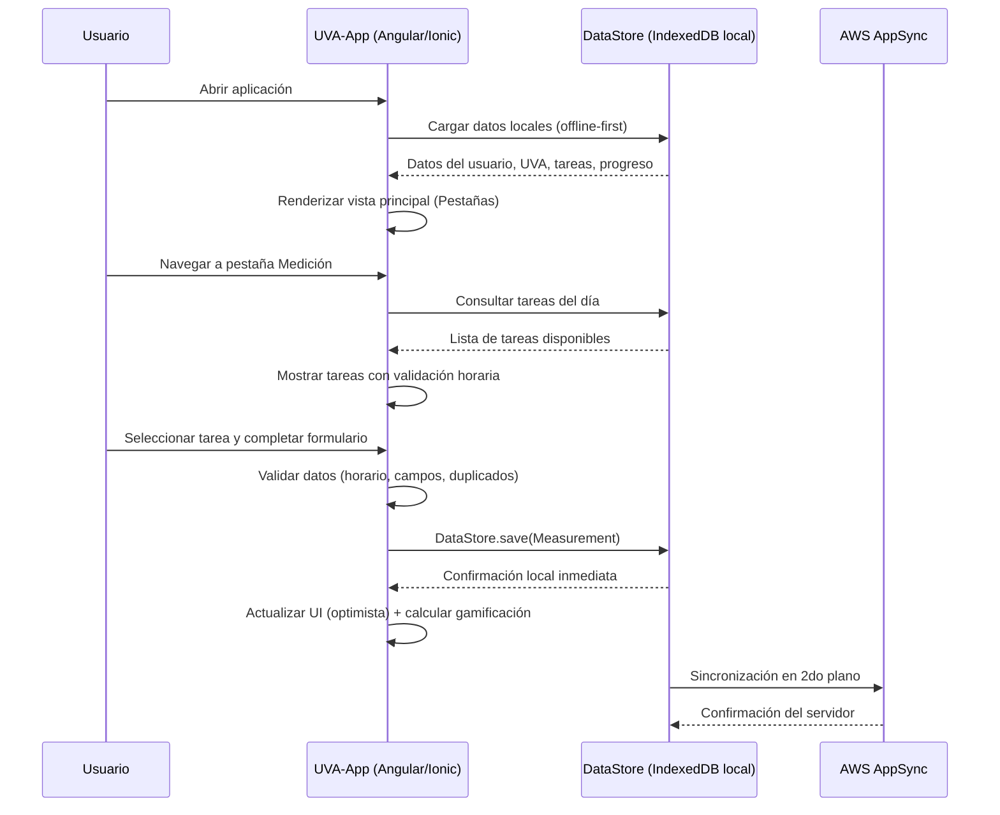

# Flujo Operacional — UVA-App Frontend

---

## Descripción General

UVA-App es una aplicación móvil offline-first para monitoreo agrícola en viñedos. Permite a agricultores registrar mediciones diarias, ver datos históricos, gestionar proyectos colaborativos (RACIMO) y seguir su progreso mediante gamificación. La app funciona completamente sin conexión y sincroniza automáticamente cuando hay internet disponible.

---

## Flujo de Operación Normal

### Flujo Principal: Registro Diario de Medición



---

## Flujos por Funcionalidad

### Flujo de Autenticación

```
1. Usuario abre la app por primera vez
   ↓
2. Pantalla de inicio → "Registrarse" o "Iniciar sesión"
   ↓
[Registro]
3. Ingresar número de teléfono (con validación de formato)
   ↓
4. Cognito envía SMS OTP (código de 6 dígitos)
   ↓
5. Ingresar código OTP → Verificación exitosa
   ↓
6. Opción: Unirse a RACIMO (código de vinculación) O Crear nuevo RACIMO
   ↓
7. Completar información del perfil (nombre, etc.)
   ↓
8. Cuenta creada → DataStore sincroniza datos → Navegar a inicio

[Inicio de Sesión]
3. Ingresar número de teléfono
   ↓
4. Cognito envía OTP
   ↓
5. Ingresar código OTP → Sesión establecida
   ↓
6. DataStore sincroniza datos del usuario → Navegar a inicio/pestañas
```

### Flujo de Medición Diaria

```
1. Usuario navega a pestaña Medición
   ↓
2. Sistema muestra tareas disponibles para hoy
   (verificación: día de semana, horario, ya completada)
   ↓
3. Usuario selecciona una tarea
   ↓
4. Sistema valida:
   - ¿Está disponible la tarea hoy?
   - ¿Está la hora actual dentro del horario permitido?
   - ¿Se ha completado la tarea hoy?
   ↓
5. Si es válido → Mostrar formulario de medición
   ↓
6. Usuario ingresa datos (con validación de campos)
   ↓
7. Enviar medición → Guardar en DataStore (local-first)
   ↓
8. UI actualizada inmediatamente (optimista)
   ↓
9. Sincronización en 2do plano con la nube
   ↓
10. Actualizar progreso de gamificación (semillas, racha)
    ↓
11. Mostrar mensaje de éxito / animación de gamificación
```

### Flujo de Datos Históricos

```
1. Usuario navega a pestaña Histórico
   ↓
2. Seleccionar rango de fechas (default: últimos 30 días)
   ↓
3. (Opcional) Filtrar por tipo de tarea o campo de UVA
   ↓
4. Sistema consulta DataStore (GSI byUVAandTs)
   ↓
5. Agregar y procesar datos
   ↓
6. Renderizar visualizaciones de Chart.js (gráficos de área/línea)
   ↓
7. Mostrar estadísticas resumidas (promedio, min, max, tendencia)
```

### Flujo de Gestión de RACIMO

```
[Unirse a un RACIMO]
1. Usuario recibe código de vinculación del administrador
   ↓
2. Seleccionar "Unirse a RACIMO existente"
   ↓
3. Ingresar código alfanumérico de 8 caracteres
   ↓
4. Sistema valida el código (GSI LinkageCodeIndex en DynamoDB)
   ↓
5. Vincular usuario al RACIMO
   ↓
6. Crear registro de UVA para el usuario
   ↓
7. Sincronizar configuración del RACIMO
   ↓
8. Usuario puede comenzar a registrar mediciones

[Crear un RACIMO]
1. Seleccionar "Crear nuevo RACIMO"
   ↓
2. Ingresar detalles: nombre, ubicación, configuración de campos
   ↓
3. Sistema genera código de vinculación único (8 caracteres)
   ↓
4. Crear registro de RACIMO → Crear UVA para el creador
   ↓
5. Establecer creador como administrador
   ↓
6. Mostrar código de vinculación para compartir con el equipo
```

### Flujo Offline

```
1. Usuario abre la app (sin internet — modo avión o zona remota)
   ↓
2. DataStore carga desde IndexedDB local
   ↓
3. Todos los datos previos disponibles para visualización
   ↓
4. Usuario registra nuevas mediciones
   ↓
5. Guardadas en DataStore local → UI actualizada inmediatamente
   ↓
6. DataStore pone en cola para sincronización
   ↓
[Más tarde, cuando hay conexión]
7. Sincronización en 2do plano comienza automáticamente
   ↓
8. Subir cambios pendientes → Descargar actualizaciones del servidor
   ↓
9. Resolver conflictos (si los hay — estrategia Auto-Merge)
   ↓
10. Notificar al usuario del estado de sincronización
```

---

## Componentes Visuales y Datos que Muestran

| Componente | Dato mostrado | Fuente de datos | Actualización |
|------------|--------------|-----------------|---------------|
| `<app-progress-bar />` | Semillas, racha y hitos del día | DataStore `UserProgress` | Al completar cada medición |
| `<app-areachart />` | Series temporales de mediciones | DataStore GSI `byUVAandTs` | Al cambiar rango de fechas |
| `<app-moon-card />` | Fase lunar actual e iluminación | `moon-phase-api.service.ts` | Al navegar a la sección lunar |
| `<app-calendar />` | Calendario mensual con fases lunares | `moon.service.ts` | Al cambiar de mes |
| `<app-header />` | Nombre de usuario y navegación | DataStore `User` | En carga de sesión |
| `<app-alert />` | Confirmaciones, errores, celebraciones | Eventos de servicios | Por evento |

---

## Manejo de Estados de UI

| Estado | Componente | Visualización |
|--------|------------|---------------|
| Cargando datos iniciales | Toda la app | Spinner de Ionic (`<ion-loading>`) |
| Sincronizando con la nube | Indicador de estado | Ícono de sincronización en header |
| Sin conexión | Toda la app | Banner de modo offline |
| Error de red | Formularios y listas | Toast con mensaje de error + botón de reintento |
| Sin mediciones en el rango | Página Histórico | Estado vacío con mensaje descriptivo |
| Tarea no disponible (horario) | Página Medición | Mensaje con próxima ventana horaria |
| Tarea ya completada hoy | Página Medición | Indicador de completado + marca de tiempo |
| Datos cargados correctamente | Todas las vistas | Contenido visible con animación suave |
| Logro desbloqueado | Overlay de celebración | Animación + SweetAlert2 con detalles del logro |

---

## Manejo de Errores

| Escenario | Comportamiento en UI | Acción del usuario |
|-----------|---------------------|-------------------|
| Token JWT expirado | Redirect automático a pantalla de login | Re-autenticar con número de teléfono |
| Sin conexión al registrar | Guardado local inmediato + indicador offline | Ninguna (sincroniza automáticamente al recuperar conexión) |
| Conflicto de sincronización | DataStore resuelve automáticamente (Auto-Merge) | Ninguna (resuelto en 2do plano) |
| Código de RACIMO inválido | Toast de error con mensaje descriptivo | Verificar el código con el administrador |
| Tarea fuera de horario | Mensaje con la próxima ventana horaria disponible | Esperar o seleccionar otra tarea disponible |
| Tarea ya completada hoy | Indicador visual en la lista de tareas | Seleccionar una tarea diferente |
| Error de subida a S3 | Toast de error + reintento automático | Reintentar manualmente si persiste |
| Versión de esquema desactualizada | Error en consola, posible fallo de DataStore | Ejecutar `amplify codegen models` y rebuild |

---

## Limitaciones Conocidas

1. **Sin paginación en la lista de tareas:** Si el número de tareas crece significativamente, puede haber impacto en rendimiento de renderizado.

2. **Fetch sin caché para fases lunares:** Cada navegación a la sección lunar hace una solicitud a la API externa si los datos del mes actual no están en caché local.

3. **Resolución de conflictos automática:** La estrategia Auto-Merge del lado del servidor puede sobrescribir cambios locales en escenarios de edición concurrente desde múltiples dispositivos.

4. **Sin soporte para iOS actualmente:** La app solo está disponible para Android. El soporte iOS está planificado para versiones futuras.

5. **Sin exportación de datos integrada en la UI (pendiente):** La exportación a CSV/PDF está definida en los casos de uso pero aún en desarrollo.

6. **Notificaciones push limitadas:** Las notificaciones actuales son locales (Capacitor Local Notifications). AWS Pinpoint para push remoto está planificado.

---

## Posibles Mejoras

1. Implementar paginación virtual en listas largas de mediciones para mejorar rendimiento con muchos registros.
2. Agregar Service Worker para mode offline web (más allá de Capacitor en móvil).
3. Implementar resolución de conflictos manual para escenarios de edición concurrente.
4. Agregar soporte para iOS (Capacitor ya tiene la infraestructura preparada).
5. Implementar exportación de datos a CSV/PDF desde la UI.
6. Activar AWS Pinpoint para notificaciones push remotas desde el backend.
7. Agregar analíticas avanzadas con ML para predicciones agrícolas.
8. Implementar modo oscuro (el sistema de variables CSS ya está preparado).
9. Agregar entrada de voz para registro manos libres en campo.
10. Implementar panel web para administradores de RACIMO.

---

## Métricas de Rendimiento Objetivo

| Métrica | Objetivo | Herramienta de medición |
|---------|----------|------------------------|
| Time to Interactive (TTI) en móvil | < 3 s | Chrome DevTools / Lighthouse |
| Tiempo de sincronización DataStore | < 2 s (conexión buena) | DevTools Network |
| Latencia AppSync API (p99) | < 500 ms | CloudWatch |
| Bundle size (main JS) | < 7 MB (límite Angular configurado) | `ng build` stats |
| Tasa de error API | < 0.1% | CloudWatch Alarms |
| Tasa de éxito en sincronización offline | > 99% | DataStore metrics |

---

## Casos de Uso Documentados

| ID | Funcionalidad | Descripción |
|----|--------------|-------------|
| CU-01 a CU-05 | Autenticación | Registro, login, OTP, recuperación, MFA |
| CU-06 a CU-10 | Medición | Registro diario, tareas, validación horaria |
| CU-11 a CU-15 | Gamificación | Semillas, rachas, hitos, tareas bonus |
| CU-16 a CU-20 | RACIMO | Crear/unirse, UVA, código de vinculación |
| CU-21 a CU-25 | Histórico | Visualización, análisis, exportación, filtros |
| CU-26 a CU-30 | Fase Lunar | Calendario, fases, recomendaciones agrícolas |
| CU-31 a CU-35 | Offline-First | Sin conexión, sincronización, conflictos |
| CU-36 a CU-40 | Perfil | Actualizar, logros, configuración, logout |
| CU-41 a CU-44 | Notificaciones | Recordatorios, alertas de racha, logros |
| CU-45 a CU-48 | Exportación | CSV, PDF, compartir, respaldo |
